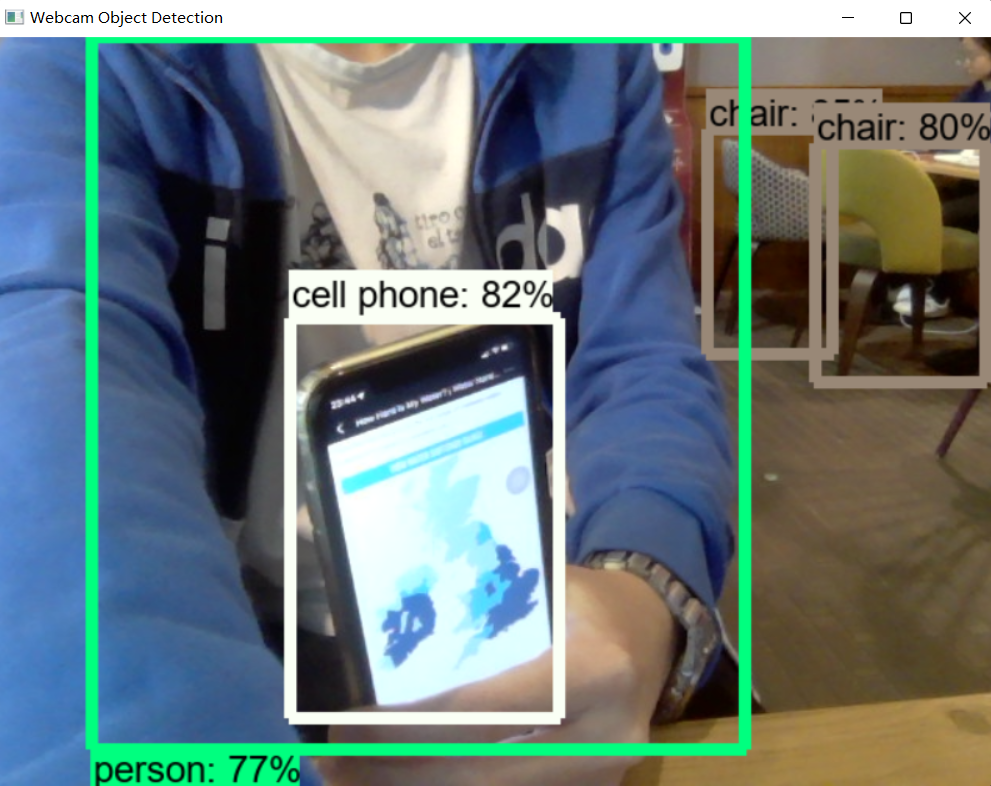

# Webcam Object Detection

## Description
This is an implementation of a webcam object detector using [TensorFlow Object Detection API](https://github.com/tensorflow/models/tree/master/research/object_detection), which is able to detect objects **in realtime**.

## Usage
Run `python3 main.py`

## Screenshots

## Performance
10-15 FPS using _NVIDIA GeForce GTX 1650_